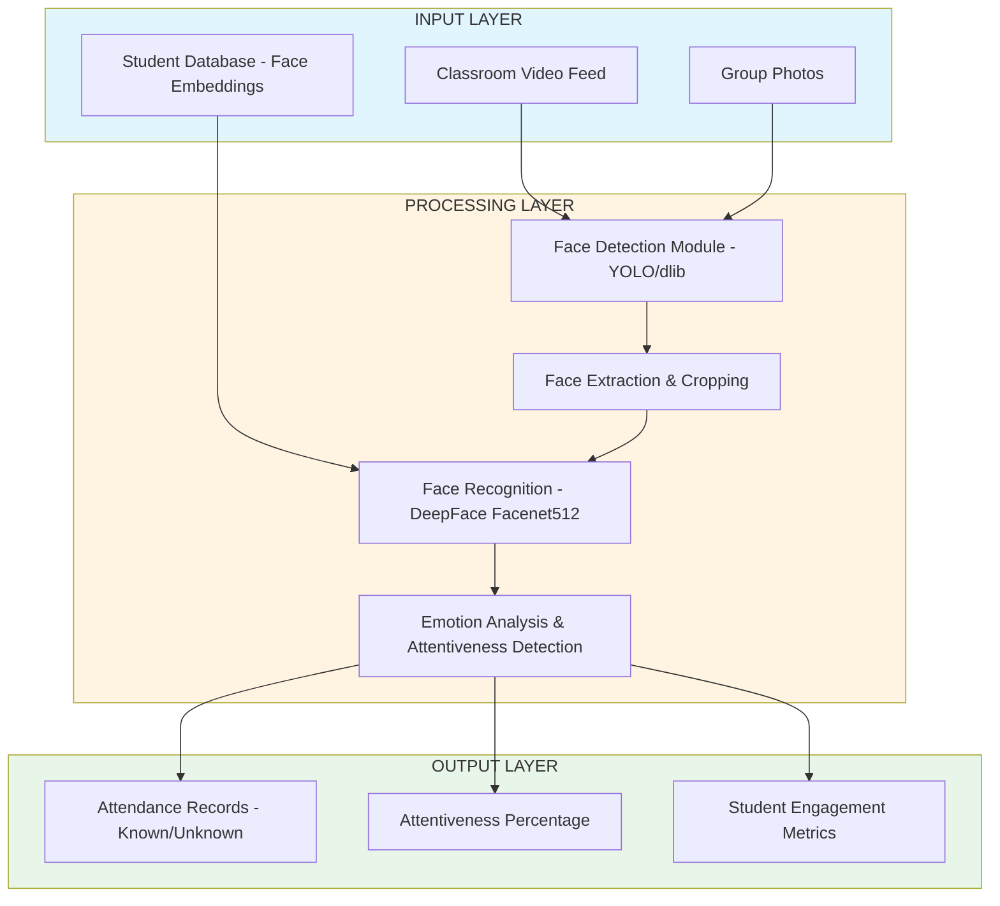

# Student Attendance & Attentiveness Tracking System

## 📋 Overview

An intelligent computer vision-based system for automated student attendance marking and real-time attentiveness monitoring in classrooms. The system uses deep learning models to detect faces, recognize students, and analyze their engagement levels throughout class sessions.

---

## 🎯 Features

- **Automated Attendance Marking**: Face detection and recognition from group photographs
- **Real-time Attentiveness Monitoring**: Continuous analysis of student engagement using emotion detection
- **Student Database Management**: Face embedding storage for accurate recognition
- **Comprehensive Analytics**: Percentage-based attentiveness metrics
- **Unknown Face Detection**: Identifies and separates unrecognized individuals

---

## 🏗️ System Architecture

### High-Level Architecture



### Low-Level System Design

#### 1. **Face Detection Pipeline**
```
Input Image/Frame
    │
    ├─→ YOLO Model (best.pt) → Bounding Box Coordinates
    │       │
    │       └─→ Face Extraction → Crop & Save (faces/)
    │
    └─→ dlib Detector → Facial Landmarks
            │
            └─→ EAR/MAR Calculation (Eye/Mouth Aspect Ratios)
```

#### 2. **Face Recognition Workflow**
```
Cropped Face Images
    │
    ├─→ DeepFace.find()
    │       │
    │       ├─→ Model: Facenet512
    │       ├─→ Database: student_faces/
    │       └─→ Similarity Matching
    │
    ├─→ Match Found
    │       └─→ Extract Name → Save to known/
    │
    └─→ No Match
            └─→ Label as Unknown → Save to unknown/
```

#### 3. **Attentiveness Analysis Flow**
```
Video Input (class_room.mp4)
    │
    ├─→ Frame Extraction (1 FPS)
    │       └─→ Save to frame_picture/
    │
    ├─→ For Each Frame:
    │       │
    │       ├─→ DeepFace.analyze(actions=['emotion'])
    │       │       │
    │       │       └─→ Emotion Scores
    │       │
    │       └─→ Check: emotion['sleepy'] < 0.5
    │               │
    │               ├─→ True: Awake Counter++
    │               └─→ False: Skip
    │
    └─→ Calculate: (awake_faces / total_faces) * (1 / num_frames) * 100
```

---

## 🛠️ Technology Stack

### Core Technologies

| Component | Technology | Version/Model |
|-----------|-----------|---------------|
| **Face Detection** | YOLO (Ultralytics) | YOLOv8s, Custom best.pt |
| **Face Recognition** | DeepFace | Facenet512 |
| **Facial Landmarks** | dlib | Frontal Face Detector |
| **Face Detection (Alt)** | RetinaFace | Latest |
| **Computer Vision** | OpenCV | cv2 |
| **Image Processing** | PIL | - |
| **Numerical Computing** | NumPy | - |
| **Database** | SQLite3 | - |
| **Deep Learning Framework** | TensorFlow (Backend) | Via DeepFace |

### Models & Their Functions

1. **YOLO (best.pt)**: Primary face detection in group photos
2. **YOLOv8s (yolov8s.pt)**: General object/face detection
3. **Facenet512**: Face recognition and embedding generation
4. **dlib Frontal Face Detector**: Real-time face detection and landmark extraction
5. **DeepFace Emotion Model**: Emotion classification (awake/sleepy detection)

---

## 📦 Dependencies

### Installation

```bash
# Create virtual environment
python -m venv venv
source venv/bin/activate  # On Windows: venv\Scripts\activate

# Install required packages
pip install -r requirements.txt
```

### requirements.txt
```
opencv-python==4.8.0.74
deepface==0.0.79
ultralytics==8.0.196
Pillow==10.0.0
numpy==1.24.3
dlib==19.24.2
retina-face==0.0.13
mysql-connector-python==8.1.0
matplotlib==3.7.2
tensorflow==2.13.0
```

---

## 📁 Project Structure

```
student-attendance-system/
│
├── main.py                      # Main attendance marking module
├── attentiveness.py             # Attentiveness tracking module
├── complete.py                  # Combined real-time detection
├── check.py                     # Face detection testing utility
├── take_picture.py              # Student enrollment module
│
├── models/
│   ├── best.pt                  # Custom YOLO face detection model
│   └── yolov8s.pt               # YOLOv8 base model
│
├── student_faces/               # Student database (embeddings)
│   └── [student_name]/
│       └── [images].jpg
│
├── faces/                       # Temporary cropped faces
├── known/                       # Recognized student faces
├── unknown/                     # Unrecognized faces
├── frame_picture/               # Extracted video frames
│
├── attendance.db                # SQLite database
├── requirements.txt
└── README.md
```

---

## 🚀 Usage

### 1. Enrollment (Adding Students to Database)

```python
# Run the enrollment script
python take_picture.py

# Captures face via webcam and stores embeddings in database
```

### 2. Attendance Marking

```python
# Process a group photograph
python main.py

# Input: group_picture_classroom.jpg
# Output: 
#   - List of recognized students
#   - Unknown faces saved separately
```

### 3. Attentiveness Monitoring

```python
# Analyze classroom video
python attentiveness.py

# Input: class_room.mp4
# Output: Average attentiveness percentage
```

### 4. Real-time Detection

```python
# Live video analysis
python complete.py

# Displays real-time face detection, recognition, and awake/sleepy status
```

---

## 🔧 Configuration

### Key Parameters

```python
# Attentiveness Thresholds
EAR_THRESHOLD = 0.2  # Eye Aspect Ratio (lower = more closed)
MAR_THRESHOLD = 0.2  # Mouth Aspect Ratio
SLEEPY_THRESHOLD = 0.5  # Emotion confidence threshold

# Frame Extraction
FPS_EXTRACTION = 1  # Extract 1 frame per second

# Face Recognition
MODEL_NAME = "Facenet512"
ENFORCE_DETECTION = False
```

---

## 📊 Function Reference

### Core Functions

#### `main.py`

| Function | Purpose | Input | Output |
|----------|---------|-------|--------|
| `faceDetection()` | Detects faces in image | Image path | Face count |
| `faceExtraction()` | Crops detected faces | Image, model, results | Saved face images |
| `faceRecognition()` | Matches faces with database | Image path | List of student names |

#### `attentiveness.py`

| Function | Purpose | Input | Output |
|----------|---------|-------|--------|
| `process_video()` | Extracts frames from video | Video path | Frame images |
| `count_awake_faces_in_frames()` | Counts attentive students | Frame directory | Awake face count |
| `calculate_percentage()` | Computes attentiveness metric | Faces, frames, awake count | Percentage |

#### `complete.py`

| Function | Purpose | Input | Output |
|----------|---------|-------|--------|
| `video_detection()` | Real-time face analysis | Video path | Live detection display |
| `faceRecognition()` | Identifies students in video | Image, cropped faces | Student names |

---

## 🎓 Algorithm Details

### Eye Aspect Ratio (EAR) Calculation

```
EAR = (||p2 - p6|| + ||p3 - p5||) / (2 * ||p1 - p4||)

Where p1-p6 are eye landmark coordinates
EAR < 0.2 indicates closed eyes (sleepy)
```

### Attentiveness Score

```
Attentiveness (%) = (Awake Faces / Total Faces) × (1 / Number of Frames) × 100
```

---

## 🔒 Privacy & Security

- Face embeddings are stored locally in SQLite database
- Unknown faces are isolated in separate directory
- No personally identifiable information is transmitted externally
- Complies with educational institution privacy guidelines

---

## 🐛 Known Limitations

- Requires good lighting conditions for accurate detection
- Performance depends on camera quality and resolution
- May struggle with occluded faces (masks, hands)
- Requires initial enrollment of all students

---

## 🔮 Future Enhancements

- [ ] Cloud-based database integration
- [ ] Mobile app for attendance viewing
- [ ] Multi-camera support
- [ ] Advanced behavioral analysis (posture, gaze direction)
- [ ] Integration with Learning Management Systems (LMS)
- [ ] Real-time alerts for low attentiveness
- [ ] Automatic report generation

---

## 📧 Contact

For questions or support, please contact: [sanjeevikumar.de@gmail.com]

---

## 🙏 Acknowledgments

- [Ultralytics YOLO](https://github.com/ultralytics/ultralytics)
- [DeepFace](https://github.com/serengil/deepface)
- [dlib](http://dlib.net/)
- [OpenCV](https://opencv.org/)

---

**Note**: This system is intended for educational purposes and should be deployed in compliance with local privacy regulations and institutional policies.
